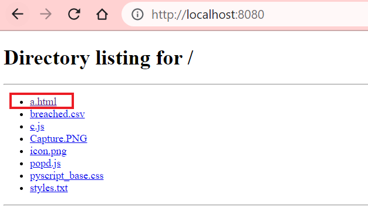

# Password Generator and Analyzer

To design a password generator and analyser that generates strong yet personalized passwords and analyses generated passwords or users’ passwords and indicate their security flaws

## Deployment

To deploy this project run first cd to the directory which contains a.html then in the terminal run the folling command.

```bash
  python -m 'http.server' 8080
```

After Running the above command open your browser and type the following the search bar

```bash
  http://localhost:8080
```

After running this command choose a.html from the avaialable options



## Inspiration

Passwords are very commonly used authentication systems due to their ease of implementation and other factors. However, it is important for a password to be strong in order for it to be effective. It is recommended to make passwords complicated with intricate patterns, however because of this users tend to forget passwords or repeat them, which again becomes a security issue. The paper [Strong Password Generation Based On User Inputs | IEEE Conference Publication](https://ieeexplore.ieee.org/document/8936178), generates passwords based on information that the user provides. This makes the password easier to remember, at the same time using an algorithm to make sure that the password generated is secure. We use this paper as our base paper to generate a strong yet easy-to-remember password.

## Screenshots


